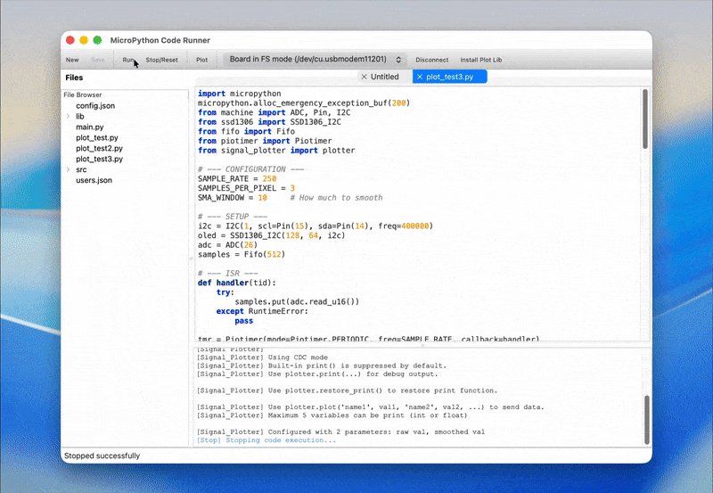

# MicroPython Plotter

This tool helps you visualize data from your MicroPython device effectively and in real-time.



## Why this tool?

### The Traditional Workflow
Usually, when working with sensors (like Heart Rate or PPG) on MicroPython, the workflow is slow and tedious:
1.  Log sensor data to a file on the device.
2.  Wait for the experiment to finish.
3.  Copy the file to your computer.
4.  Analyze and plot the data.

**Result:** You can't see what's happening *now*. Tuning filters or debugging signal issues becomes a slow cycle of "record -> check -> retry".

### The Solution: Real-time Preview
**MicroPython Plotter** changes this by providing a **Real-time Preview** of your data.
*   **Instant Visualization:** See your sensor data immediately as it happens.
*   **High Performance:** Capable of plotting 5 channels at ~700Hz.
*   **Quick Iteration:** Includes a basic code editor to let you tweak parameters, run the code, and see the results instantly.

> **Note:** The built-in code editor is designed for quick adjustments (the "Plot -> Tweak -> Run" loop), not to replace your full-featured IDE. It is currently a proof of concept with room for improvement.

It won't break your MicroPython device, **but always backup the important data in you MicroPython device when using this tool.**

## Key Features

### Interactive Plotting
*   **Zoom & Pan:** Inspect signal details closely by zooming in and out.
*   **Customization:** Change line colors to easily distinguish between different data channels.
*   **Pause/Resume:** Freeze the display to analyze a specific moment without losing the data flow.
*   **Automatic Legends:** Variable names transmitted from your code (e.g., `plotter.plot('temperature', t)`) automatically appear in the plot legend, making it easy to identify signals.

### Future Roadmap
*   **History View:** Review past data sessions.
*   **Data Saving:** Improved export options for further analysis.
*   **Better Editor:** Add more features to the built-in code editor.

## Installation

Before coding, you need to install the library for plotting on your device. There are three ways to do it:

### Use the installation helper in the program (recommend)
1. Connect your device to the computer  
2. On the toolbar, click the button called `Install Plot Lib` (on the right)

### Use the installation script
1. Connect your device to the computer  
2. Make sure you have `mpremote` package in your python environment, or install it.
3. Run the `install.sh` or `install.cmd` script in your terminal

### Use other tools
1. Connect your device to the computer
2. Open tools such as Thonny.
3. Upload the `signal_plotter.py` file to the **`lib`** folder on your device.


## How to Use in Code

Using the plotter is very easy.

1. Import the library in the file you want to use

   ```python
    from signal_plotter import plotter
   ```

2. Call `plotter.plot('name', value, ...)` with named variables

   **Important:**
   - Use the format: `plotter.plot('name1', value1, 'name2', value2, ...)`
   - Maximum 5 pairs of names and variables allowed
   - Variable names must be strings
   - Values must be int or float

   **Correct example:**

   ```python
    import time
    from signal_plotter import plotter
    
    for i in range(10000):
       plotter.plot('x', i, 'y', 2*i, 'z', 3*i)
       time.sleep(0.05)
   ```

   **Incorrect examples:**

   **❌ Missing names:**
   ```python
    from signal_plotter import plotter
    
    # ERROR: Arguments must be name-value pairs
    plotter.plot(100, 200, 300)
   ```
   
   **❌ Multiple plot locations:**
   ```python
    from signal_plotter import plotter
    
    for i in range(10000):
       plotter.plot('x', i, 'y', 2*i)
       for j in range(100):
           plotter.plot('x', j)  # Multiple calls will confuse the receiver
           time.sleep(0.05)
   ```

## Why doesn't `print()` work anymore?

To make the plotting fast and smooth, this library **disables the standard Python `print()` function** by default. Namely: nothing will happen when you print..

**If you want to enable the original print():** You can turn it back on by running `plotter.restore_print()` anytime after importing the library.

For example:
```python
    from signal_plotter import plotter
    plotter.restore_print() # enable the print function
    
    for i in range(10000):
       plotter.plot('x', i, 'y', 2*i)
       for j in range(100):
           plotter.plot('x', j)  # Multiple calls will confuse the receiver
           time.sleep(0.05)
```
Another way is to use `plotter.print("message")` instead, when you need to print something.


## Additional Notes
- **Data Types:** Values can be integers (`int`) or decimals (`float`). Note that `float` values are automatically converted to integers before sending.
- **Limit:** You can plot a maximum of 5 variables at the same time (which means 10 arguments total).
- **Single Location:** Call `plotter.plot()` at only one place in your code (can be inside a loop).
- **Visualizing:** Open the micropython-plotter software to see your graphs in real-time using `Plot` tool.

- **On macOS**: You might receive a warning about the application and can't open it, open the `terminal` and run `xattr -d com.apple.quarantine <path-to-micropython-plotter>`, change the path to your actual path and name such as `micropython-plotter_macos_arm64.app`
